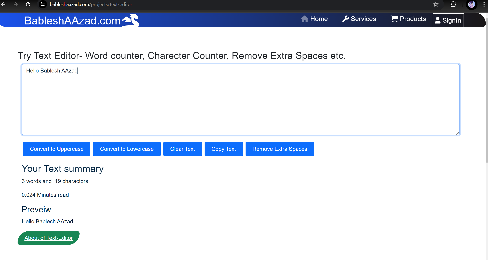
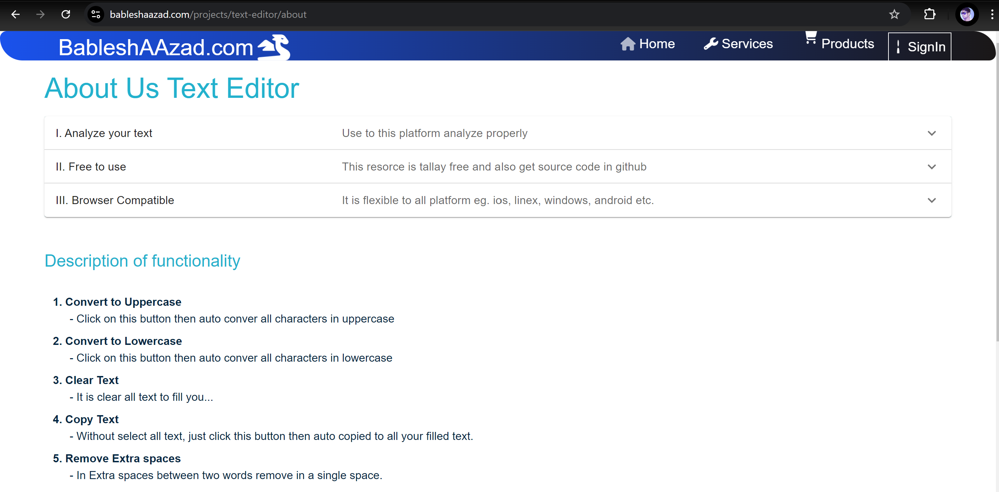
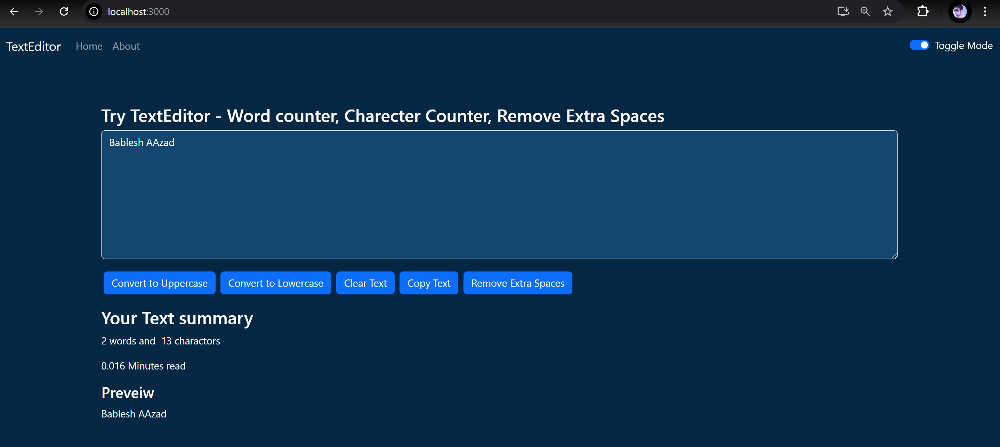

## 📝✒️ Text Editor Web App [BableshAAzad.com](https://bableshaazad.com/projects/text-editor)

Welcome to the Text Editor Web App, where you can easily edit and customize your text. Perform actions like `Convert To UpperCase`, `Convert To LowerCase`, `Remove Extra Spaces`, and more. You can also count the characters and words in your text. Ready to edit your text? Visit [Text-Editor](https://bableshaazad.com/projects/text-editor).

---

**🏠 Features:**
- Customize text with various transformations.
- Count characters and words.
- Convert text to lowercase or uppercase.
- Remove extra spaces and copy the output.
---

**🧑‍💻 Technologies Used:**

`ReactJS` `BootStrap` `JavaScript` `HTML` `CSS`

---

**💻 How to Use the Source Code:**
1. Download the `main` branch as a zip file.
2. Import the project into your IDE and ensure Node.js is installed.
3. In the root directory, open a command prompt and run: `npm install`.

---

#### 📝 Project UI Examples 🔍

>- 🔍 Home Page

  

>- 🔁📝 About Page

  

>- 🌑🌙 Dark Mode View

  

